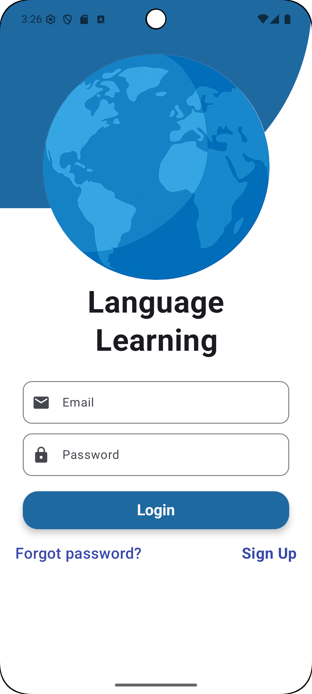
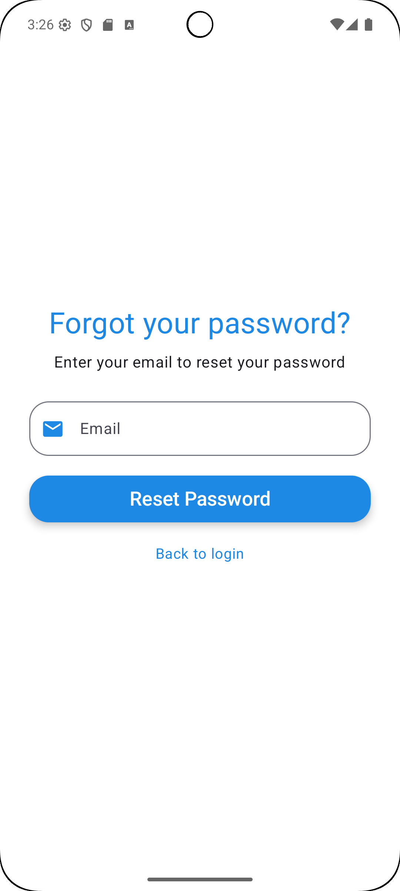
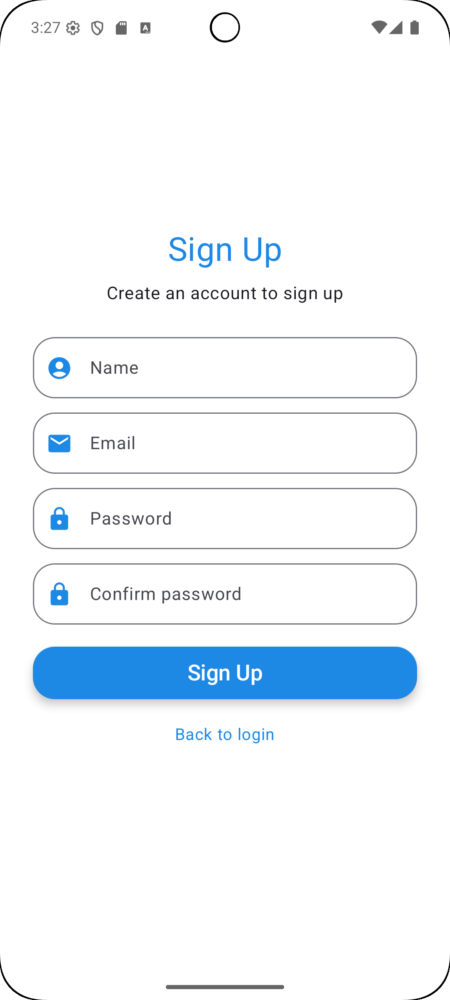
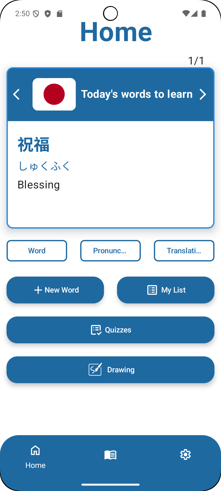
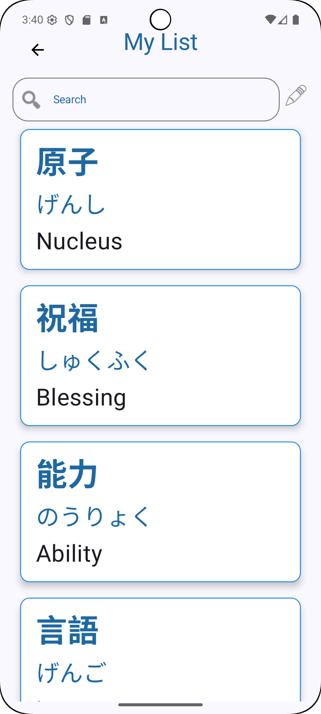
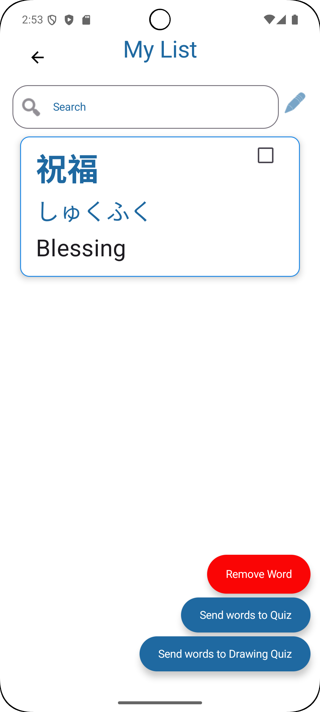
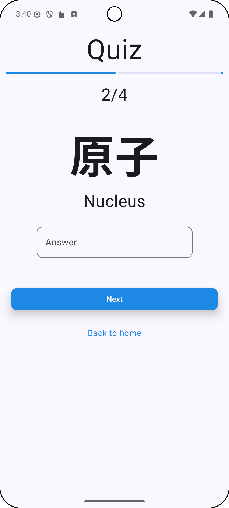
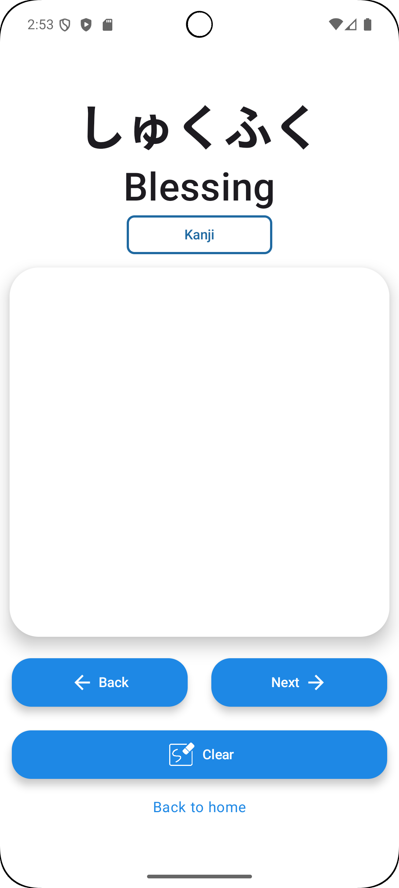
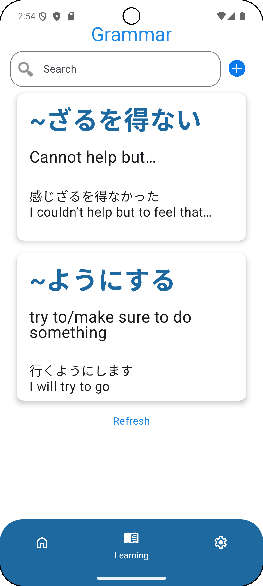

A language learning application, that helps the users manage their vocabulary in a dictionary form and they can also collect the grammar points, that they are learning during their language learning journey.

  
  
  
  
  
  
  
  
  
  

